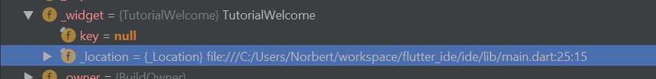

# Current Approach


## Basic idea

Each widget has a visual-widget counterpart. The visual-widget takes
the same arguments as the original widget (in addition to some meta data
which is discussed later).

```dart

Scaffold(
  body: Text("Hi")
);

VisualScaffold(
  body: Text("Hi")
);

```

The visual-widgets are intended to be as simple and as close to the original as
possible, as it should be possible to auto generate them later on. 
Visual widgets also provide a way to modify the interaction during 
visual editing (for example a Column needs a bit of tweaking to provide a
good UX).

### Starting from blank

Each widget which is dragged in is a visual-widget. It registered its
properties and children to the system and is ready to receive new children
and property updates. 

Each time something is modified the tree is converted to the source code
string. Each visual-widget recursively adds its source code by taking its
class name and passing all the present values as properties.

Starting from blank is already implemented but there are a bunch of things
to consider, therefore this might get refactored at some point.


### Starting from existing source code

This is where stuff becomes interested. Starting from a blank canvas
is already super cool, but it's even cooler when opening up a preexisting 
widget and changing stuff.


#### Current idea 

The goal is to convert a standard widget to a visual-widget.

This:
```dart
Widget build(BuildContext context) {
    return Scaffold(
      body: Center(
        child: Text("Text"),
      ),
    );
  }
```

to this:

```dart
Widget build(BuildContext context) {
    return VisualScaffold(
      body: VisualCenter(
        child: VisualText("Text"),
      ),
    );
  }
```

##### Naive approach: RegEx

This example would certainly be possible to parse via regex, but regex would 
probably fail miserably once things become more complex.

##### Dart Kernel Transformers

Check out this article if you want to learn more about the dart VM: https://mrale.ph/dartvm/
 

Brief overview of what it is:
WHen compiling dart code, it is first compiled to something called 
"dart kernel binaries" (those are the .dill files you see when you look
into a compiles dart project). This "language" is then handed to the VM for execution.

Before the kernel file is haded to the VM, a set of kernel transformers are 
executed, these operate on the kernel-AST.

Here are a few examples of how kernel-transformers are used inside the 
dart language: https://github.com/dart-lang/sdk/tree/cb6127570889bed147cbe6292cb2c0ba35271d58/pkg/kernel/lib/transformations

Fun fact: here the famous tree shaking happens! (https://github.com/dart-lang/sdk/blob/cb6127570889bed147cbe6292cb2c0ba35271d58/pkg/kernel/lib/transformations/treeshaker.dart)


Flutter also uses this kernel transformation when adding the [file location](https://github.com/flutter/engine/blob/master/flutter_kernel_transformers/lib/track_widget_constructor_locations.dart)
to widgets.



This allows the inspector to open up the actual instantiation of the selected
widget compared to only the declaration. 

##### Using kernel transformers

Converting widgets to their representative visual-widget is pretty easy because
we have access to the AST (meaning we have comments etc. already stripped out).

**Retaining source code**:

An example: Functions.
Consider this code snipped.

```dart

FloatingActionButton(
  onPressed: () {
    print("Hello");
  }
);
```

We are passing a function to the FAB. When parsing back to the source code
we might call `toString()` on each property. Unfortunately calling `toString()`
on a function yields `Closure: () => Null`, which is the correct type but the 
actual source code is lost.

My idea was to modify the parameters to include necessary source code as
string.

```dart
VisualFloatingActionButton(
  properties: {
    'onPressed': '() {'
    '  print("Hello");'
    '}'
  }
  onPressed: () {
    print("Hello");
  }
);
```
or

```dart

FloatingActionButton(
  onPressed: FunctionProperty(
    source: 'print("Hello");',
    function: () {
      print("Hello");
    }
  ), 
);
```

When converting back we have all necessary information needed to reconstruct the
original source code.


##### Edge cases

There are a bunch of edge cases which fortunately can all be handled gracefully.

**Property is not constant**:
```dart

Container(
  color: widget.color
);

```

Possible solution: disable editing this property in the editor, or make
an option to unbind from the data.

**Child is not a constructor invocation**:

```dart
Container(
  child: widget.child,
);
```

Possible solution: again disable editing/ moving that child.

On the other hand, build methods like these are pretty common:

```dart
Widget build(BuildContext context) {
  Widget child = Text("Hey");
  
  return Container(
    child: child,
  );
}
```

All the tools needed to figure out where the widget is originally created are 
available through the kernel transformer, it would be possible to make widgets 
originating from withing the same class editable.

Problem 2: Generating the original code 

Generating the original source code from the above 
example the naive way would result in this:

```dart
Widget build(BuildContext context) {
  Widget child = Text("Hey");
  
  return Container(
    child: Text("Hey"),
  );
}
```

The container recursively builds the widgets but disregards widgets potentially
being instantiated somewhere else.

Possible solutions:

 ```dart
 Widget build(BuildContext context) {
   Widget child = VisualWidget("Hey");
   
   return VisualContainer(
     child: DifferentOriginWidget(
      origin: Origin(
        lineNumber: 42,
        caretStart: 4,
        caretEdn: 34,
      ),
      widget: child,
     ),
   );
 }
 ```

#### From visual to code and back

When visually editing the widget, it should still be possible to edit 
the underlying source code. 
This should be pretty easy to implement because all that would have to be done
is hot reload the (always up to date) source code. 

 
 
## Result

When all of this is implemented, the IDE will be capable of running 
independent widgets and applying any modifications (even on a smartphone). 

Possible workflow:

- Open up a .dart file.
- Each widget has a run button besides it (like IntelliJ has for main methods)
- When pressing the run button, the view is split the widget is rendered on the
right and the code is shown on the left.
- Visually changing the widget results in instant source code updates.
- Code updates result in a hot-reloaded visual representation


#### Alternative ideas

An alternative idea could be to write all this code into the Flutter
framework itself. Therefore the `Center` widget could have some switch inside
which changes it from a regular widget to a visual-widget.

This would eliminate the need of having to convert widgets to something else.

It would even be possible to compile apps inside to IDE against the modified
Flutter source code, therefore not needing the user to have two separate
Flutters installed.

But this also has a few downsides:

- There would need to be quite a few changes to internal widget behaviour, which
    could cause merge conflicts on newer Flutter versions and an overall harder
    development experience.
- It wouldn't be so easy to iteratively add new widgets.