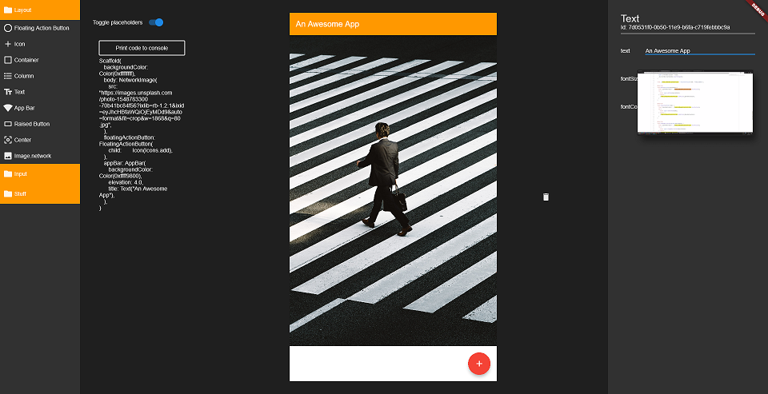

# Flutter-IDE

An IDE for Flutter written in Flutter.

### Stateful visual builder.

Work on the layout while keeping state.

### Drag and drop that produces quality code

Number one goal is not to replace coding layouts but enhance it.

### Building for different screens at the same time

Preview your live changes on as many different screen sizes as you want.

### Extensible and hackable

Don't want to use the Flutter-IDE but like the visual editor? Use the plugin!

Need new tools? Write a plugin for this IDE!

## What is already done?

- A lot of research and trial and error
- Server client communication (you can run the actual app on a phone for instance 
and change properties on your work machine)
- A working implementation of the interactive widget builder (though, I think
there might be a better solution)
- Basic IDE architecture

## 1.0 features

- Having a file browser for the Flutter project
- Opening a file which contains a widget should open the visual builder
ready to change the widget. The source could should be updated each time a 
constant property is changed.
- All Flutter widgets should be available

## Module overview 

_More documentation coming_

### Visual Components

Are the building blocks for the visual editor. They themselves are not
execrable on their own. Rather they are used by the App-Linker to enable
visual editing.

### App-Linker

A server which handles all source code translations. Editing source values
goes through this server.

### The IDE, which contains all the IDE code.

# Components

## Naming conventions

### Components
Each element which can be edited is called $NAME$Component, for example the wrapped
Text widget is called TextComponent.
(There might be a few classes named Visual$NAME$, this was the old naming and it will disappear over time)

### Property

Right now every property is called $NAME$Property, so for String it is a StringProperty.
Might be changed in the future because some names clash with flutters diagnostics.

### PropertyChanger

$NAME$Changer - StringChanger

# Creating a new editable property

## Creating new things

### Creating a new property

1. Creating the property class and updating the converter
2. Implementing the changer and returning it in the property_editor.dart widget 

### Creating a new widget

1. Using the "component" live-template
2. Creating a new BuildingBlock in "dynmaic_widget" returning it "editor_widget"

If the widget has children itself wrap each child in a LayoutDragTarget, assign it a final GlobalKey. Then
return each WidgetProperty

kernel-transformer:
Flutter repo - packages/tools/lib/src/compile.dart line 201 - starts engine-frontendserver

