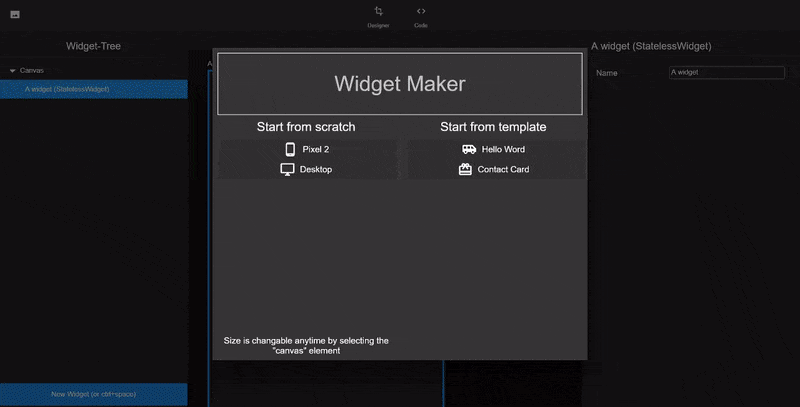
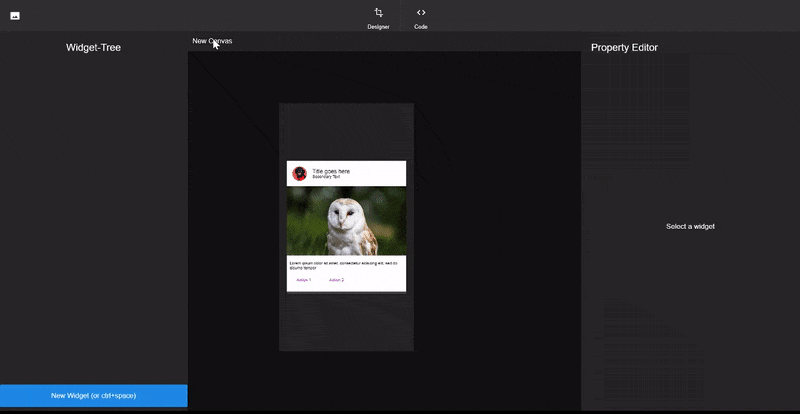
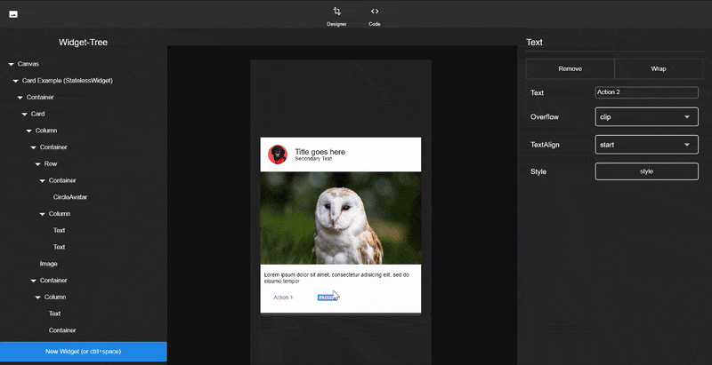

# The Widget-Maker



## State of the project

The project is currently not maintained by me and the code could probably sure it fair bit
of refactoring.

This README is still work in progress.

If anybody is interested in contributing/ forking/ using it as a base for another project - feel free!


## Features

- Templates
- Different Canvas sizes
- Build and "Play" (interact with UI) mode
- Multiple Canvases and instantiation
- Code Generation




## Building 

This is intended to be run using Flutter Desktop or Flutter web. 
For Desktop, simply switch to the master channel and run:
```
flutter run -d [windows|linux|macos)
```

## The concept

A few words about the code architecture


### Widget-Elements

Widget-Elements play a central part in the Widget-Maker as these are actual widgets
you drag around and style. 
The Widget-Elements can be found under [`lib/data/widget_elements`](lib/data/widget_elements).

Widget-Elements form a forth tree (on top of Widgets/RenderObjects and Elements) they include
a lot of meta information.
Widget-Elements only manage the tree, but not the actual rendering, interaction and modification
of the widgets, that is up to the widget which is generated by the `generatedWidget()` method.
Those widgets have to mix in `ElementWidgetStateMixin`, that class contains code which handles common UX scenarios
like accepting children via drag, or showing a border on selection.


#### Making new Widget-Elements

You certainly can make new Widget-Elements by hand, in fact Widget-Elements such as the `Scaffold`,
`Row` and more are hand made.

But a lot of widgets are pretty basic, so instead of copy-pasting the same wrapper code over and over again,
there is a generator which does that for you.

Take a look at (lib/Data/widget_elements/config.yaml and README.md) to get a sense of the schema.

To generated those widget simply execute the [`lib/data/widget_elements/scripts/build.dart`](lib/data/widget_elements/scripts/build.dart) file.
Be sure to be inside the script folder when running that script because it relies on relative paths!

```
dart build.dart
```


### Properties

The [`MProperty`](lib/data/properties/basic_properties.dart) is the base class for all properties inside the Widget-Maker.
Each Widget-Element has a list of properties. These properties reflect the constructor parameters
of the widgets in code.
Properties are responsible for providing a way of changing themselves and providing meta information.

For more information take a look at [lib/data/properties/basic_properties.dart](lib/data/properties/basic_properties.dart) 


## Running the test

Not all tests seem to pass as of now.

```
flutter test
```


## Website

The docs folder contains the source for www.widgetmaker.dev

## Donations

Feel free to donate a pizza/ coffee :)

<a href="https://www.buymeacoffee.com/norbertkozsir" target="_blank"></a>